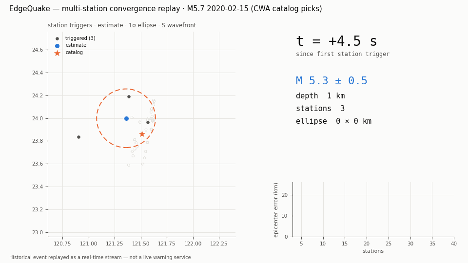
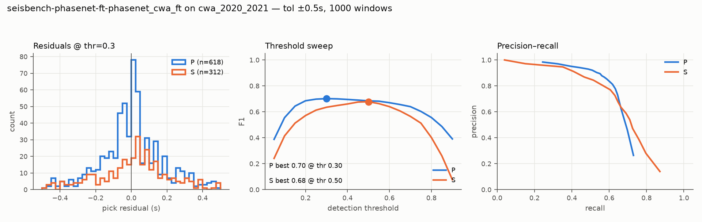
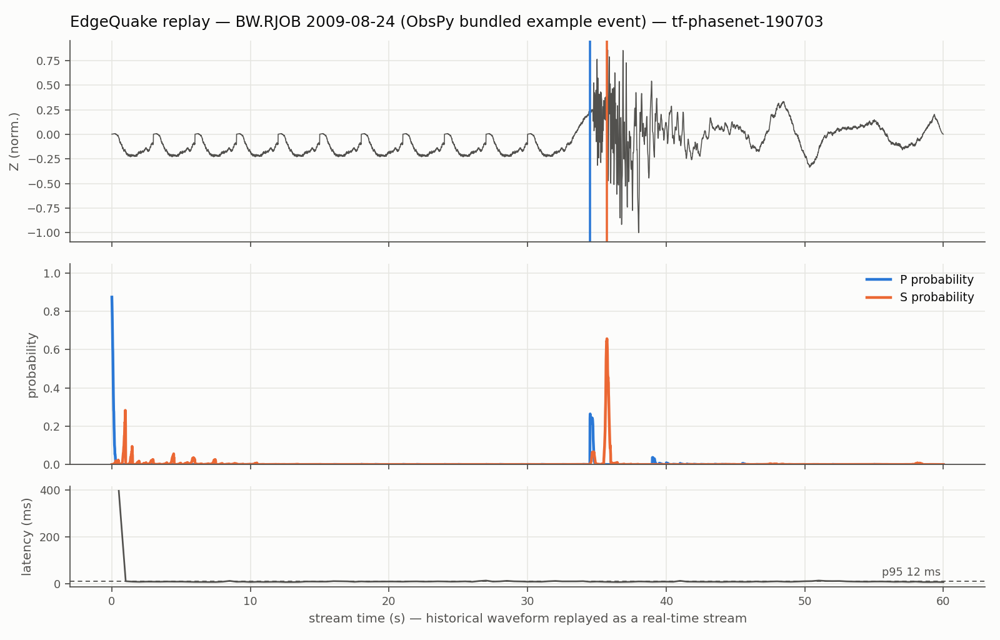

# EdgeQuake

**Real-time seismic phase picking for Taiwan: a streaming replay engine, cross-domain benchmarks, and a CWA-finetuned PhaseNet.**

> Historical seismic waveforms replayed as real-time streams — **not** a live
> earthquake warning service. Taiwan already operates an official EEW system
> (CWA); this project studies the technology *behind* such systems: how fast
> and how reliably AI can read raw seismograms, how confidence should be
> calibrated, and what breaks along the way.

[中文版說明在下方](#中文說明) | English first, Chinese below.

---

## Highlights

- **Streaming replay engine**: ring buffer + sliding-window inference over
  historical waveforms at true real-time pacing; picks with confidence and
  per-step latency (p50 ≈ 4–9 ms on laptop CPU — far under the 500 ms hop).
- **Cross-domain benchmark** (protocol after Münchmeyer et al. 2022): the same
  PhaseNet architecture, two public pretrained weights, three test domains.
  Off-the-shelf PhaseNet loses **0.24 P-wave F1** when moved from its home
  region to Taiwan — the quantified case for local fine-tuning.
- **Taiwan fine-tune** (CWA 2019, 70k traces, Kaggle T4, frozen BatchNorm +
  amplitude clipping): **P F1 0.660 → 0.702, S F1 0.557 → 0.680**, with the
  biggest gain exactly where domain shift hurt most (S recall 0.52 → 0.69).
- **Honest engineering log**: seven real failures (upstream Windows URL bug,
  BatchNorm-stats poisoning by dead channels, label-channel misalignment, ...)
  with root causes and fixes — see [Pitfalls](#pitfalls-what-actually-broke).



*A real M5.7 Taiwan event replayed station-by-station: at +6 s after the first
trigger the system already reports M5.6 ± 0.5; the 1σ ellipse shrinks from
69×17 km to 9×3 km. (Catalog picks; homogeneous velocity model.)*

## Results

Phase-picking F1 on time-split test sets, ±0.5 s tolerance, threshold 0.3
unless noted:

| Weights (training domain) | Test domain | P F1 | S F1 | Note |
|---|---|---|---|---|
| original (NCEDC, N. California) | NCEDC in-domain (paper) | 0.896 | 0.801 | reference |
| original | Iquique (Chile) | 0.873 | 0.771 | mild cross-domain drop |
| original | **CWA (Taiwan)** | **0.660** | **0.557** | large drop; recall 0.59 |
| stead (STEAD, global) | Iquique (Chile) | 0.390 | 0.281 | severe miscalibration |
| stead | **CWA (Taiwan)** | **0.228** | **0.220** | best-threshold P only 0.25 |
| **cwa-ft (this repo)** | **CWA (Taiwan)** | **0.702** | **0.680** @thr 0.5 | +0.04 P / +0.12 S |



Three takeaways: (1) Taiwan's domain gap is far larger than Chile's — mixed
instrumentation (CWASN short-period/broadband + TSMIP strong-motion) and local
geology matter; (2) "trained on global data" does not imply cross-domain
robustness — STEAD weights lose to single-network weights everywhere we
tested; (3) a fixed confidence threshold is not transferable across weights
(STEAD's optimal S threshold is 0.80) — calibration must be a first-class
metric.

## Quick start

```bash
pip install -r requirements.txt

# streaming replay demo (bundled real earthquake)
python scripts/demo_replay.py

# evaluation pipeline sanity check (synthetic dataset, seconds)
python scripts/make_synthetic_dataset.py
python scripts/eval_picking.py --dataset data/synthetic_test --limit 50

# small real-data benchmark (Iquique, ~5 GB download on first use)
python scripts/eval_picking.py --dataset iquique --limit 500

# Taiwan (CWA) — size-preview guard prevents accidental 100 GB downloads:
python scripts/eval_picking.py --preview-cwa _2019 _2020 _2021
python scripts/fetch_cwa_hf.py          # fast Hugging Face route (~27 GB / 3 yrs)
python scripts/eval_picking.py --dataset cwa --chunks _2020 _2021 --confirm-download --limit 1000

# evaluate the fine-tuned weights
python scripts/eval_picking.py --dataset cwa --chunks _2020 _2021 --confirm-download \
    --limit 1000 --state-dict outputs/phasenet_cwa_ft.pt
```

Fine-tuning runs on Kaggle (free GPU): build the compact training subset
locally with `scripts/make_cwa_train_subset.py` (~3.5 GB from the cached 2019
chunk), upload it as a Kaggle Dataset, then run
`kaggle/edgequake_cwa_finetune.ipynb`.

Phase 2 (location + magnitude):

```bash
python scripts/build_event_catalog.py                       # 1,317 multi-station events
python scripts/demo_convergence.py --event 20121013190      # 2020 Yilan M6.6 deep event
python scripts/make_convergence_gif.py --event 20021510590  # animated replay GIF
```



## Repository layout

```
src/edgequake/
├── pickers/        # Picker interface; SeisBench PhaseNet (+ finetuned ckpt), TF fallback
├── replay/         # ring buffer + replay engine (streaming inference, latency, triggers)
├── eval/           # benchmark protocol: residuals, PR/threshold sweeps, false alarms
└── data/           # dataset loaders with download guards (CWA/CEED size preview)
scripts/            # demo, evaluation CLI, dataset builders, CWA fetch/fix utilities
kaggle/             # fine-tuning notebook (BN-freeze + amplitude-clip recipe)
outputs/            # evaluation figures/JSON + finetuned weights (1.1 MB)
```

## Pitfalls (what actually broke)

| Problem | Root cause | Fix in this repo |
|---|---|---|
| All SeisBench dataset downloads 404 on Windows | upstream uses `os.path.join` for URLs → backslash | monkeypatch in `data/loader.py` |
| CWA/CEED never fall back to Hugging Face | upstream `compile_from_source` defaults to False | enabled in loader |
| CWA via SeisBench repo = 43 GB/yr uncompressed at ~1.3 MB/s | repo stores raw HDF5 | `fetch_cwa_hf.py`: compressed HF route, resumable |
| pandas crash on CWA metadata | mixed timestamp formats (some rows lack fractional seconds) | `fix_cwa_metadata.py` |
| Our own eval mislabeled TSMIP windows | arrival samples stored at original 200 Hz, waveforms resampled to 100 Hz | rescale arrivals by `trace_sampling_rate_hz` (P F1 0.629 → 0.660) |
| First fine-tune silently destroyed the model | labeller outputs [P,S,Noise] but PhaseNet channels are "NPS" | permute labels to model order + pre-training sanity assert (initial loss must be < 2) |
| Second fine-tune collapsed to constant output at inference | dead channels → per-window std-normalize → 1e9-scale values → BatchNorm running_var poisoned to 1.4×10¹⁸ | freeze BN during fine-tune + clip inputs to ±30σ |

The meta-lesson: **loss is a proxy; task-level evaluation is not optional.**
The collapsed model had a beautiful training loss (0.115) and a
plausible-looking val loss (0.21 ≈ the score of always predicting "noise"),
yet scored F1 = 0 on the actual picking task.

## Roadmap

- **Phase 2 — multi-station convergence**: hypocenter + magnitude updated as
  stations trigger one by one; uncertainty ellipses; anytime prediction.
- **Phase 3 — historical case replay**: 2024 Hualien M7.2 and 2025 Chiayi
  events, decision layer aligned with Taiwan's public-alert thresholds;
  MapLibre dashboard.
- **Phase 1 extras**: false-alarm rate on CWANoise, confidence calibration
  curves, longer training + partial BN unfreeze (current 0.70 is a
  conservative 15-epoch single-year recipe; in-domain ceiling is ~0.85+).

## Data & acknowledgements

- **CWA Benchmark** (Taiwan): Tang, K.-W., K.-Y. Chen, D.-Y. Chen, T.-L. Chin,
  and T.-Y. Hsu (2024), *The CWA Benchmark: A Seismic Dataset from Taiwan for
  Seismic Research*, SRL, doi:10.1785/0220230393.
- **PhaseNet**: Zhu, W. and G. C. Beroza (2019), GJI, doi:10.1093/gji/ggy423.
- **SeisBench**: Woollam, J. et al. (2022), SRL, doi:10.1785/0220210324.
- **Benchmark protocol**: Münchmeyer, J. et al. (2022), JGR: Solid Earth,
  doi:10.1029/2021JB023499.
- Iquique dataset: Woollam et al. (2019); STEAD: Mousavi et al. (2019).

This is a research prototype. It must not be used as, or presented as, an
operational earthquake warning service. Redistribution of real-time strong-
motion alerts in Taiwan requires an agreement with the CWA.

## License

[MIT](LICENSE)

---

<a name="中文說明"></a>

# 中文說明

**台灣即時地震波相位辨識研究原型：串流回放引擎、跨域基準測試、CWA 微調 PhaseNet。**

> 本專案將歷史地震波形以真實時間速度回放模擬即時串流，**不是**即時地震警報
> 服務。台灣已有中央氣象署的官方預警系統；本專案研究的是預警背後的技術：
> AI 能多快、多可靠地讀懂原始地震波，信心值該如何校準，以及過程中什麼會出錯。

## 重點成果

- **串流回放引擎**：ring buffer + 滑動視窗推論，真實時間節奏回放；輸出含信心
  值的 picks 與逐步延遲（筆電 CPU p50 約 4–9 ms，遠低於 500 ms 的串流節奏）。
- **跨域基準**（依 Münchmeyer et al. 2022 協定）：同一 PhaseNet 架構、兩組公開
  預訓練權重、三個測試域。現成 PhaseNet 從原生區域搬到台灣，**P 波 F1 掉了
  0.24**——「台灣需要在地微調」的量化證據。
- **台灣微調**（CWA 2019 年 7 萬條、Kaggle T4、凍結 BatchNorm + 振幅裁剪）：
  **P F1 0.660 → 0.702、S F1 0.557 → 0.680**，受益最大的正是跨域傷最重的
  S 波（recall 0.52 → 0.69）。
- **誠實的工程記錄**：七個真實故障（上游 Windows 網址 bug、死通道毒壞
  BatchNorm 統計、標籤通道錯位……）連同根因與修法，見上方 Pitfalls 表。

## 三個發現

1. 台灣的 domain gap 遠大於智利——混合儀器（CWASN 短周期/寬頻 + TSMIP 強震儀）
   與在地地質都有影響。
2. 「用全球大資料訓練」不保證跨域穩健——STEAD 權重在所有測試域都輸給單一
   區域網訓練的權重。
3. 固定信心門檻不可跨權重沿用（STEAD 的 S 最佳門檻高達 0.80）——校準必須是
   第一級評估指標。

## 核心教訓

**Loss 只是代理指標，任務級評估不可省。** 崩潰的模型有漂亮的 train loss
（0.115）和看似合理的 val loss（0.21——恰好是「永遠回答噪音」的分數），
但在真正的相位辨識任務上 F1 = 0。

## 使用方式與後續路線

安裝與指令見上方英文 Quick start；後續：Phase 2 多站收斂與定位（測站逐一
觸發、誤差橢圓動態收斂）、Phase 3 歷史事件回放（0403 花蓮、2025 嘉義）與
PWS 門檻決策層 + MapLibre 儀表板。

本專案為研究原型，不得作為或宣稱為即時地震警報服務；台灣即時強震警報之
再散布需與中央氣象署簽約。授權：MIT。
