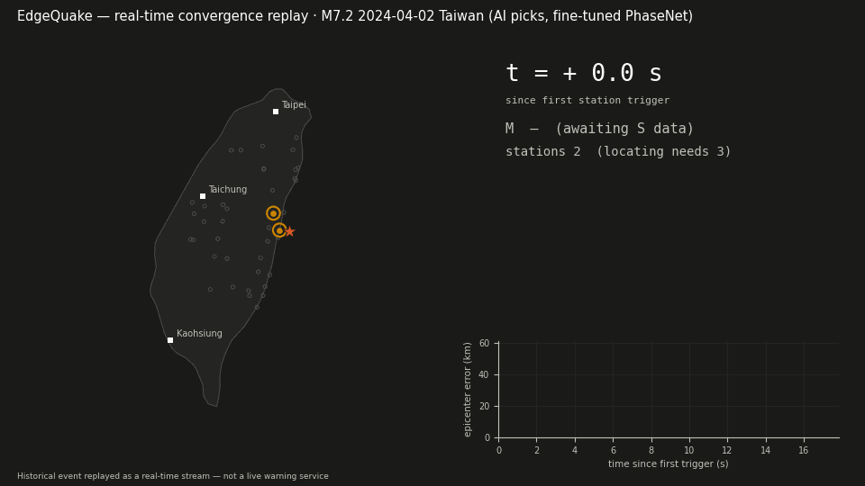

# EdgeQuake

**An earthquake early-warning system prototype for Taiwan — validated on
temporally out-of-sample historical events, running live on community sensor data, and audited
automatically on significant earthquakes surfaced by CWA's post-event
waveform feed (polling-based, so back-to-back events can be missed).**

> **What this is, in three precise statements.**
> The **system** is an EEW prototype: the full chain (waveforms → AI phase
> picking → association → location → magnitude → county alert decision →
> notification) exists and runs, validated on out-of-sample events the
> models never saw. The **website** is an earthquake console: live CWA/USGS
> bulletins, a real-time detection layer on the ExpTech community network,
> and auditable replays of historical events. It is **not** a warning
> *service*: that requires real-time access to the national seismic network,
> 24/7 operations, and legal authority — all of which belong to the CWA.
> Everything here is labeled accordingly.

**Live console:** <https://edgequake-three.vercel.app> — real-time monitor
(CWA + USGS + live engine state relayed from a 24/7 cloud VM), full replays
of the 2024 Hualien M7.2 and 2025 Dapu ML6.4 earthquakes, and a public
**audit log**: after each significant Taiwan earthquake the workflow
replays the official waveforms through the estimation chain and commits
the result — timings are reported as lower bounds (see the audit notes).

[中文版說明在下方](#中文說明) | English first, Chinese below.

---

## At a glance

- **First real-event audit** (2026-07-31 00:58 Taiwan time, Taitung M4.7,
  fully automated post-hoc arrival-time replay — picker/compute latency
  not modeled, so times are lower bounds):
  first location **origin+4.9 s**, EEW issuance criteria met at
  **origin+9.2 s** (a lower bound — not comparable with official
  issuance times, which include the latencies not modeled here), final magnitude
  **M4.81 vs CWA M4.7** with 17 km epicenter error — and the public-alert
  gate **did not trigger** (event below the PWS thresholds: M≥5.0 with
  a county at predicted intensity ≥4, or M≥6.5 with intensity ≥3).
  True negatives are part of the record.
- **Out-of-sample replays** (post-hoc arrival-time, same caveat):
  2024-04-03 Hualien M7.2 first located at origin+3.8 s, final epicenter
  error ~21 km (110/112 stations picked); 2025 Dapu ML6.4 first located
  at origin+5.2 s, final error ~9 km, final magnitude **M6.38 vs ML6.4**.
- **Taiwan fine-tune** of PhaseNet: P F1 **0.660 → 0.702**, S F1
  **0.557 → 0.635** (same protocol, threshold 0.3) — after measuring,
  under one identical protocol, a **0.21 P-F1 cross-domain drop** for the
  off-the-shelf weights (Chile 0.873 → Taiwan 0.660).
- **Per-station empirical residual corrections** (from 327k raw catalog
  rows → 67,216 QC'd station-event records, 737 stations) halve the mean
  final-magnitude error across the replay suite (0.17 → 0.08).
- **Impact, not just magnitude**: every estimate carries a PAGER-style
  population-exposure figure (WorldPop 1 km grid, ~0.4 ms per evaluation)
  and the most similar historical earthquakes from a 53-year catalog.
- **Runs on free infrastructure end to end**: a GCP e2-micro VM detects on
  137 community MEMS stations 24/7, relays state through a serverless
  Redis to the public page, GitHub Actions performs the post-event audits,
  and Gemini writes bilingual event reports — total cost $0.

## How it works

**Two distinct pipelines** — keep them apart when reading anything below:

1. **Offline research pipeline**: official post-event / historical
   waveforms → fine-tuned PhaseNet P/S picking → location → magnitude.
   This is where the AI picker lives, and where the out-of-sample
   replays and audits run.
2. **Live experimental PGA pipeline**: the community network delivers
   1 Hz PGA/PGV per station — not waveforms — so the live path uses
   PGA-jump triggers in place of phase picks and reuses the same
   location/magnitude chain. **No waveform AI runs in the live path
   today.**

**Detection chain.** Per-station ring buffers on a shared time grid;
picks (or triggers) pass **incremental association** (a new pick must
match the current solution's predicted P within ±3.5 s — the defense
against runaway-deep solutions absorbing mispicks), then a vectorized
grid-search locator with bootstrap error ellipses and a hard 80 km
crustal depth ceiling — one canonical depth policy now shared by the
live engine and the offline replay. Magnitude inverts a PGA-attenuation relation
fitted on the 2019 training year only, with **per-station empirical
residual corrections** (dominated by site effects, and absorbing a small
aggregation-convention offset — both documented); a distance-conditioned
CNN gives a fast second opinion from the first 3 s of P (documented as
saturating for M6.5+ — an information limit, not a model bug). Intensity
is a **PGA-only approximation** of the CWA scale; the official scale
uses PGV at intensity 5− and above.

**Two-tier alerting.** An **EEW tier** mirrors the CWA issuance rule
(M≥4.5 and predicted intensity ≥3) for timestamping and audit comparison;
the **PWS tier** mirrors the national cell-broadcast criteria and drives
actual notifications (email / Telegram / webhook), guarded by quality
gates earned from real failures: ≥6 stations, error ellipse ≤80 km, and
≥25 gal actually observed somewhere — because a real M6.5+ shakes the
ground, and phantom events never do.

**Live operation.** `run_live.py --source trem` runs 24/7 on the ExpTech
TREM community MEMS network (publicly reachable API, attributed,
reference-only; written usage confirmation from ExpTech is being
sought — a reachable API is not by itself a data license) from a
free cloud VM, pushing state snapshots to Upstash Redis; the public
console reads them through a serverless endpoint, so during a real
earthquake any visitor sees the epicenter, P/S wavefronts, triggered
stations, magnitude convergence, population exposure, and the closest
historical analogs — live.

**Self-auditing loop.** After each significant quake, CWA publishes the
official strong-motion waveforms (observed ~12 min in our first case;
CWA marks the dataset's cadence as irregular). A GitHub Actions workflow
polls every 15 minutes, downloads new packages, and performs a
**post-hoc arrival-time replay**: picks are extracted offline from the
full waveforms, then fed causally — each appearing only at its arrival
time — through the estimation chain. Picker window, compute, and
transport latency are *not* modeled, so reported detection times are
**lower bounds**, and the replay uses the estimation chain rather than
the byte-identical live engine (closing that gap is on the roadmap). The
workflow writes a machine-readable record (timing, magnitudes, errors,
alert decisions, exposure, `pop_version`), has an LLM narrate it
bilingually — machine-validated: comparative wording is forbidden, the
lower-bound statement is mandatory, and numbers are checked by
core-number + decimal-token grounding (presence, not semantic role;
general integers are not grounded, but bilingual local date, year and
clock time are machine-checked — every clock time stated in the
Chinese half must match a time in the record, and the English half
must carry the 24-hour local time) — and commits
everything back. Results are committed as computed, with no manual
curation; the poll-based design can miss back-to-back events inside one
15-minute window.

## Verified results

Phase picking (time-split test sets, ±0.5 s tolerance):

| Weights (training domain) | Test domain | P F1 | S F1 |
|---|---|---|---|
| original (NCEDC, N. California) | NCEDC in-domain (paper) | 0.896 | 0.801 |
| original | Iquique (Chile) | 0.873 | 0.771 |
| original | **CWA (Taiwan)** | **0.660** | **0.557** |
| stead (STEAD, global) | CWA (Taiwan) | 0.228 | 0.220 |
| **cwa-ft (this repo)** | **CWA (Taiwan)** | **0.702** | **0.635** |

The NCEDC row is **paper-reported under a different matching protocol**
and is shown for orientation only; every other row was computed by this
repo's harness under one identical protocol (±0.5 s tolerance, threshold
0.3, matching `outputs/eval_*.json`) — the cross-domain conclusion rests
on the same-protocol Chile→Taiwan comparison.



Out-of-sample replays against the official record (post-hoc
arrival-time; times are lower bounds):

| Event | Location | Magnitude vs official |
|---|---|---|
| 2024-04-03 Hualien M7.2 (offshore) | origin+3.8 s, final err 20.9 km | climbs M5.4 (origin+6 s) → **M7.08** final — reproducing the early M7+ underestimation seen operationally, consistent with PGA saturation |
| 2025-01-21 Dapu ML6.4 (inland) | origin+5.2 s, final err 8.6 km | site-corrected final **M6.38** (Δ0.02) |
| 2026-07-31 Taitung M4.7 (audit; local date) | 17 km, origin+4.9 s (lower bound) | final M4.81 (Δ0.11); EEW at origin+9.2 s (lower bound); below PWS thresholds, no alert |

Site-effect correction, final magnitude vs catalog:

| Event | raw | site-corrected |
|---|---|---|
| Taitung M4.7 | Δ0.06 | Δ0.11 |
| Hualien M7.2 | Δ0.21 | **Δ0.12** |
| Dapu M6.4 | Δ0.25 | **Δ0.02** |

Every figure above is transcribed from
[`outputs/results_summary.json`](outputs/results_summary.json) — a run
manifest carrying the canonical parameters, file hashes, and the git
commit it was computed from. `scripts/build_results_summary.py --verify`
recomputes every recorded hash (results, sources, checkpoints), enforces
the two-phase provenance protocol (the recorded commit must be HEAD or
an ancestor whose diff to HEAD touches only derived artifacts, and no
non-derived path may be dirty — at generation time or at verify time),
semantically checks the
reproduction report (verdict, full event coverage, checkpoint identity,
artifact hashes), requires the manifest to list exactly the required
hash/source key sets (a manifest that silently lists less fails),
requires the audit record's numbers to have matched a fresh canonical
recomputation at generation time (`audit_cross_check`, covering EVERY
audit record in the archive — the content hash alone proves only that
a record did not change afterwards), pins
every repo-committed public audit artifact (reports, audit indexes,
dashboards, and every tracked file in the audit archive — the required
list is rebuilt from the tree at verify time, so a newly audited event
that is not yet pinned fails verification until the summary is
regenerated; the audit workflow regenerates and verifies before it is
allowed to push. Raw waveform ZIPs stay out of the repo by design —
their SHA-256 is recorded inside each audit record produced by the
current workflow; records predating that field carry replay-JSON and
raw-log provenance instead), proves
the summary's
own quote list is consistent with its recorded event values (the
summary cannot hash itself), records the execution environment
(Python/NumPy/SciPy/pandas/ObsPy versions — recorded provenance,
reported on drift but not enforced by `--verify`, whose checks are
environment-independent; numeric sensitivity is caught by the
generation-time cross-checks and the reproduction harness; pin with
`requirements-lock.txt`), and
checks each quoted figure is present in this README while known-stale
figures are absent — any drift fails loudly. Alert decisions in audit
records carry machine-derived gate evidence (`pws_evidence`), and the
report's PWS wording is generated verbatim from it — the narrated
"reason" is computed, never invented. Checkpoint provenance:
`outputs/v3_verify_x83.pt` is **byte-identical** to
`outputs/phasenet_cwa_ft.pt` (same SHA-256), i.e. the replay artifacts
were produced with the committed fine-tuned weights under an alternate
filename; and
[`outputs/reproduction_report.json`](outputs/reproduction_report.json)
is a machine-generated reproduction record — raw-waveform hashes,
checkpoint hash, environment versions, full canonical-JSON comparison,
verdict `identical_canonical_json` —
regenerable with `scripts/verify_replay_reproduction.py` (needs the GDMS
raw waveforms, which exceed repo size limits). The two GDMS replay
*artifacts* (0403, Dapu) are fully reproducible by that harness; the
Taitung audit replay came from CWA's post-event waveform zip and is
outside it; and the checkpoint's *training run* is only partially
traceable — three different provenance levels, each labeled.

**Warning-time characteristics.** Available warning time is primarily
constrained by source distance and seismic-wave travel time. Offshore
events may provide useful lead time for more distant cities, while
communities near the epicenter of inland events (Dapu, Meinong) may lie
within the S-wave blind zone and receive little or no warning — the
replay tab shows exactly that. The replay results above report only the
verified post-hoc lower-bound timings; end-to-end operational latency
has not yet been measured.

## Limitations

Point-source GMPE with average-site county predictions; intensity is a
PGA-only approximation (official CWA intensity uses PGV at 5− and
above); magnitude saturation for M6.5+ from 3 s of P; homogeneous
velocity model (~10–15 km location floor); audit timings are post-hoc
lower bounds (picker/compute/transport latency not yet modeled);
replayed alert decisions share the live engine's numeric quality gates
but approximate observed-PGA timing (a station's record peak counts once
its S-window has passed; the live engine uses causally-observed PGA);
picker evaluation so far covers 1,000 event windows — a continuous-noise
false-alarm rate is still to be measured; community MEMS data is
reference-only and its station codes carry no residual corrections yet;
population exposure assumes static residential distribution; and this is
a research prototype — not, and never presented as, an operational
warning service.

## Pitfalls (the ones worth telling)

| Problem | Root cause | Fix |
|---|---|---|
| Fine-tune collapsed to constant output — with a beautiful training loss | dead channels → per-window std-normalize → 1e9-scale values poisoned BatchNorm running stats | freeze BN during fine-tune + clip inputs to ±30σ; **loss is a proxy, task-level evaluation is not optional** |
| First fine-tune silently destroyed the model | labeller output order ≠ model channel order ("NPS") | permute labels + a pre-training sanity assert (initial loss must be < 2) |
| Live engine drifted to depth 149 km, M8.1 mid-event | S/coda picked as "P" at low-SNR stations; a free-depth solver absorbs late picks with tiny residuals | incremental association ±3.5 s + S-leg gating + hard 80 km ceiling |
| First live night: two phantom M6.6+ alert emails, no earthquake | 2.5 gal trigger threshold below the urban MEMS noise floor (2–4 gal); random noise associations fit a deep/offshore solution and "3 gal at 200 km" inverts to M6.6 | 8 gal threshold + 2-poll persistence + 150 km declaration radius + alerts require ≥25 gal observed |
| First LLM report truncated at 298 chars | Gemini flash "thinks" by default and thinking tokens count against `maxOutputTokens` | thinkingBudget 0 + larger cap + completeness check with retry |
| A 921-day M6.4 aftershock wore the "921 集集大地震" label | famous-event names matched by date only | names attach only when magnitude matches the mainshock ±0.4 |

A longer engineering log (13 entries) is kept offline.

## Quick start

```bash
pip install -r requirements.txt

# run the verification-guard regression tests (each encodes a hole an
# external review actually found)
python -m unittest discover -s tests

# exact versions used for the canonical results (requirements.txt is
# deliberately loose; use the lockfile to reproduce numerics)
pip install -r requirements-lock.txt

# replay a bundled real earthquake through the streaming engine
python scripts/demo_replay.py

# rebuild the console from the replay data
python scripts/build_dashboard.py

# rehearse the live engine on 0403 (simulated TREM feed, true pacing)
python scripts/run_live.py --source trem-sim --event 0403 --speed 4

# run it for real (community MEMS network, notifications via env config)
python scripts/run_live.py --source trem --notify
```

Evaluation scripts are included (SeisBench harness, dataset download
guards against accidental 100 GB pulls). The full training
recipe/artifacts are **not** included in this repository.

## Repository layout

```
src/edgequake/
├── pickers/        # PhaseNet interface (+ fine-tuned checkpoint)
├── replay/         # ring buffer + streaming replay engine
├── live/           # live engine, TREM source, notifier, state relay
├── location/       # locator, magnitude, site terms, replay simulation
├── models/         # AI early-magnitude (MagNet-style)
├── impact.py       # PAGER-style population exposure
└── similar.py      # historical similar-event retrieval
scripts/            # run_live, audit ingest, builders, data fetchers
assets/             # population grid, quake catalog, coastline (all versioned)
docs/ · vercel/     # the built console + Vercel deployment unit (incl. /api)
outputs/            # model weights, site terms, replay data, audit archive
.github/workflows/  # shadow-audit + data-freshness automation
```

## Roadmap

Causal audit parity (route audits through the live engine via a
simulated feed, modeling picker/compute latency, so audited times stop
being lower bounds); a validation matrix for warning reliability:
continuous no-event data (per-hour false-alarm rate), station dropout,
packet delay, clock skew, large teleseisms, typhoon/construction noise,
and concurrent events; self-calibrating residual corrections for TREM
MEMS stations; growing-window "anytime" AI magnitude against M6+
saturation; a 1-D Taiwan velocity model; phase association (GaMMA); a
Raspberry Shake as a true on-site sensor node.

## Data & acknowledgements

- **CWA Benchmark** (Taiwan): Tang, K.-W., K.-Y. Chen, D.-Y. Chen, T.-L. Chin,
  and T.-Y. Hsu (2024), *The CWA Benchmark: A Seismic Dataset from Taiwan for
  Seismic Research*, SRL, doi:10.1785/0220230393.
- **PhaseNet**: Zhu, W. and G. C. Beroza (2019), GJI, doi:10.1093/gji/ggy423.
- **SeisBench**: Woollam, J. et al. (2022), SRL, doi:10.1785/0220210324.
- **Benchmark protocol**: Münchmeyer, J. et al. (2022), JGR: Solid Earth,
  doi:10.1029/2021JB023499.
- Iquique dataset: Woollam et al. (2019); STEAD: Mousavi et al. (2019).
- CWASN waveforms via the CWA Geophysical Database Management System
  (GDMS): CWA Seismographic Network, doi:10.7914/SN/T5.
- **CWA Open Data** (opendata.cwa.gov.tw): earthquake bulletins
  (E-A0015/16) and post-event strong-motion waveforms (E-A0015-004).
- **ExpTech TREM** (exptech.dev): community MEMS real-time network, used
  read-only via their publicly reachable API with attribution (written
  usage confirmation being sought) — community data, reference
  only, not an official source.
- **WorldPop** (www.worldpop.org): Taiwan 1 km population grid, Global2
  release R2025A (constrained UN-adjusted, 2026 estimate), University of
  Southampton. CC BY 4.0.
- **USGS FDSN event service** (earthquake.usgs.gov): 1973–present Taiwan
  regional catalog for similar-event retrieval; USGS Earthquake Hazards
  Program feeds on the console.
- Map data: © CARTO / OpenStreetMap contributors; NLSC (內政部國土測繪中心)
  WMTS.

This is a research prototype. It must not be used as, or presented as, an
operational earthquake warning service. Redistribution of real-time strong-
motion alerts in Taiwan requires an agreement with the CWA.

## License

[MIT](LICENSE)

---

<a name="中文說明"></a>

# 中文說明

**台灣地震早期預警系統原型——以樣本外真實歷史事件重放驗證、在社群測網上
即時運行、並對 CWA 事後波形源公布的顯著地震自動稽核（輪詢制，連續事件
可能漏收）。**

> **定位，三句話講清楚。** 這個**系統**是 EEW 原型：完整偵測鏈（波形 → AI
> 相位辨識 → 事件關聯 → 定位 → 規模 → 縣市警報判定 → 通知）全部存在且在
> 運行，並以模型從未見過的樣本外事件重放驗證。這個**網站**是地震主控台：CWA/USGS
> 即時速報、ExpTech 社群測網上的即時偵測層、與可稽核的歷史事件回放。它
> **不是**警報「服務」：那需要國家測網的即時介接、24 小時運維與法定權責——
> 這些屬於中央氣象署。本專案所有介面均如實標示。

**線上主控台：** <https://edgequake-three.vercel.app> ——即時監測（CWA 速報
＋USGS 全球＋雲端引擎即時狀態）、0403 花蓮 M7.2 與大埔 ML6.4 的完整回放、
以及公開稽核紀錄。

## 一眼看懂的數字

- **首筆全自動稽核**（2026-07-31 台灣時間 00:58，台東 M4.7；採事後到時
  重播，未計入拾取與運算延遲，**時間為理論下界**）：發震後 **4.9 秒**
  完成首次定位、**9.2 秒**達到強震即時警報發布條件（此為理論下界，
  不可與包含各項延遲的官方發布時間直接比較）；最終規模 **M4.81**
  對官方目錄 M4.7，震央誤差 17 公里。
  未達國家級警報門檻（M≥5.0 且有縣市預估震度≥4，或 M≥6.5 且≥3），
  系統**未發布警報**；
  「沒發警報」也是紀錄的一部分。
- **樣本外事後重播**（同為到時重播，時間為下界）：0403 花蓮 M7.2 於發震後
  3.8 秒首次定位、最終誤差約 21 公里（110/112 站成功辨識）；大埔 ML6.4 於
  發震後 5.2 秒首次定位、最終誤差約 9 公里，最終規模 **M6.38 對 ML6.4**。
- **台灣在地微調**：先在同一套評估協定下量化跨域差距（原始權重在智利
  P F1 0.873、搬到台灣掉到 0.660，**同條件下降 0.21**），再用在地資料把
  P 拉到 **0.702**、S 從 0.557 拉到 **0.635**（同門檻 0.3）。
- **測站經驗殘差修正**：從 32.7 萬筆原始目錄紀錄，經品管後得 67,216 筆
  站-事件紀錄、737 個測站的修正項，讓樣本外重放最終規模的平均誤差**減半**
  （0.17 → 0.08）。
- **不只報規模，還報影響**：每次估計同步算出曝險人口（WorldPop 1 公里
  人口網格，單次僅 0.4 毫秒），並從 53 年的地震目錄找出最相似的歷史事件。
- **整套跑在免費資源上**：GCP 免費 VM 全天候監測 137 個社群測站、
  Upstash 中繼即時狀態、GitHub Actions 自動稽核、Gemini 撰寫雙語報告
  ——總成本 0 元。

## 系統怎麼運作

**先分清楚兩條性質不同的管線**：一是**離線研究管線**——官方事後波形與
歷史波形 → 微調 PhaseNet 辨識 P/S → 定位 → 規模，AI 拾取器只活在這裡，
樣本外重放與稽核也在這裡跑；二是**即時實驗性 PGA 管線**——社群測網給的是每秒
的 PGA/PGV 數值而非連續波形，所以線上路徑以 PGA 跳升代替相位、沿用同一套
定位與規模鏈，**目前線上路徑沒有任何波形 AI 在跑**。

**偵測鏈。** 每個測站有自己的環形緩衝，掛在同一條時間軸上。pick（或觸發）
必須吻合當前解所預測的 P 波到時（±3.5 秒）才能加入事件——這道「增量關聯」
是防止錯誤 pick 把解拖向深部的關鍵防線。定位採向量化網格搜尋加 bootstrap
誤差橢圓，深度設 80 公里硬上限；規模反演使用只以 2019 訓練年擬合的
衰減式，並用每站的**經驗殘差修正項**消除偏差（以場址效應為主，也吸收了
少量統計慣例偏移，兩者都有記載）；AI 模型另外從 P 波前 3 秒給出快速的
第二意見（M6.5 以上會飽和，這點如實記載——那是資訊極限，不是模型的錯）。
震度為 **PGA 近似值**：中央氣象署新制震度在 5 弱以上採 PGV 判定，本系統
數值不等同官方震度。

**兩級警報。** EEW 級對齊中央氣象署強震即時警報的發布條件（M≥4.5 且預估
震度 ≥3），負責記錄時間戳、供稽核對比；PWS 級對齊國家級警報門檻，實際
發送通知（Email／Telegram／webhook）。發報前還要通過從真實失敗學來的
品質閘門：至少 6 站定位、誤差橢圓 ≤80 公里、且必須有測站**實測 ≥25 gal**
——真的 M6.5 會真的搖，幽靈事件不會。

**預警時間特性。** 可用預警時間主要受震央距離與地震波傳播時間限制。
外海事件可能為較遠城市提供一定的反應時間；內陸地震震央附近則可能位於
S 波盲區，幾乎沒有可用預警時間——回放頁展示的正是這件事。上方重播結果
僅呈現已有產物支撐的事後理論下界，系統端到端的實際延遲仍待量測。

**即時運行。** 引擎全天候跑在免費雲端 VM 上，接 ExpTech TREM 社群測網
（可公開連線的 API、註明出處、僅供參考；書面使用確認洽詢中——API 可連線
不等同資料授權），狀態快照經 Upstash Redis 中繼到公開
主控台。真的地震發生時，任何訪客都能即時看到震央、P/S 波前、觸發測站、
規模收斂、曝險人口與相似歷史事件。

**自我稽核。** 顯著地震後官方會釋出強震波形（首例觀察約 12 分鐘；CWA
標示此資料集為不定期更新）。GitHub Actions 每 15 分鐘輪詢，抓到新事件就
執行**事後到時重播**：先離線從完整波形取得 picks，再讓每個 pick 只在其
到時後才進入估計鏈。拾取視窗、運算與傳輸延遲**尚未**計入，所以稽核報出
的時間是理論下界；重播走的是估計鏈而非位元級相同的 live 引擎（補齊這個
差距已列入 roadmap）。結果寫入機器可讀紀錄、由 LLM 敘述成雙語報告，
報告經機器驗證（禁用比較性措辭、必含下界聲明、核心數字與小數 token
接地——token 精確比對且排除舊敘事欄位作為來源；驗證涵蓋數字存在性
而非語意位置；一般整數不接地，但雙語的本地日期、年份與時刻會機器
核對——中文段落中出現的任何時刻都必須對得上紀錄內的時間，英文段落
必須含 24 時制本地時刻）；警報判定附**機器推導的閘門證據**
（`pws_evidence`），報告中的 PWS 敘述由證據逐字組句——「原因」是算
出來的，不是 LLM 寫出來的。全部 commit 回 repo——結果照算照登、
無人工篩選；輪詢制在極端連發情境可能漏收同窗口內的較早事件。

## 已知限制

這個系統有明確的邊界：點震源假設、均勻速度模型（定位誤差地板約 10–15
公里）、M6.5 以上的規模飽和；震度為 PGA 近似值，不等同採 PGV 判定高震度
的官方新制；稽核時間為事後重播的理論下界；重播的警報判定與線上引擎共用
同一組數值品質閘門，但「已觀測 PGA」的時序為近似（測站峰值於 S 波窗過後
即列入計算，線上引擎則使用截至當下實際觀測值）；拾取器評估目前止於 1,000 個
事件窗，連續無震資料的每小時誤報率尚待量測；社群測站資料僅供參考，其
測站代碼尚無殘差修正項；曝險人口以常住人口靜態估計，不分日夜。最重要的
一條：本專案是研究原型，不得作為或宣稱為即時地震警報服務——台灣即時
強震警報的再散布需與中央氣象署簽約。ExpTech TREM 為社群觀測資料，僅供
參考。授權：MIT。
